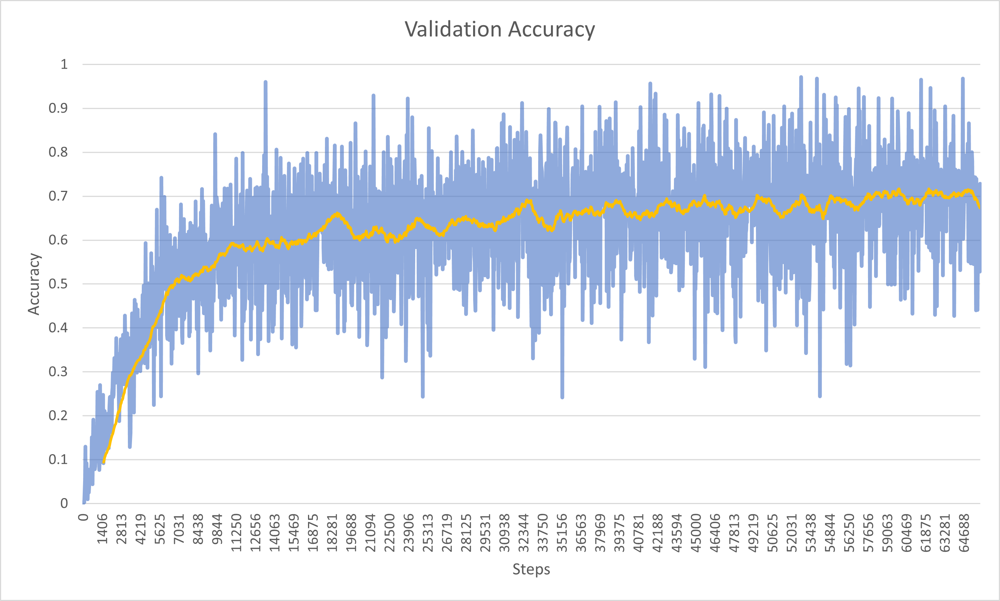
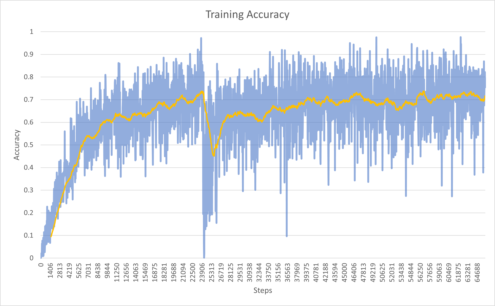
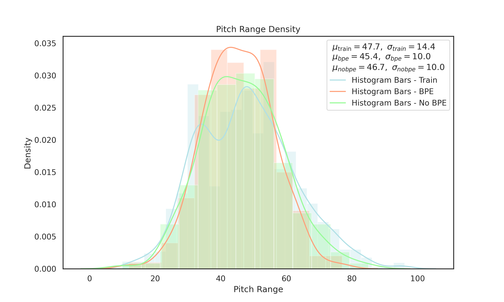
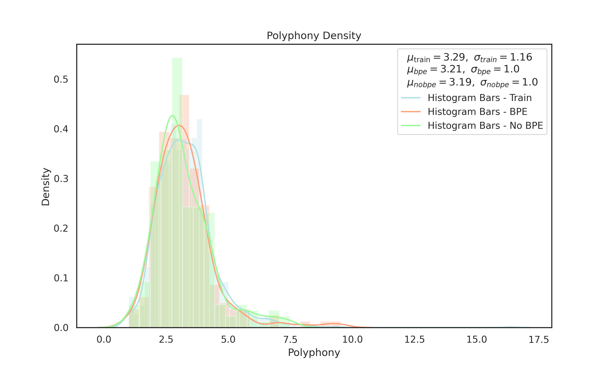

# Solo Piano Music Transformer: Quantized
A transformer model for generating solo piano compositions trained on a subset of [MMD data](https://github.com/jeffreyjohnens/MetaMIDIDataset "MMD data") and a smaller collection of MIDIs that I've gathered myself.

**The transformer is built with music producers/ composers in mind:** The generated output is less human-like in terms of timing, instead the** notes are quantized** and can be easily converted into sheet music and **fit neatly into the grid of a DAW piano roll**. This simplfies the process of working with the produced continuations significantly.

The best performing version uses REMI tokenization and byte-pair encoding (BPE). While it achieves lower accuracy (~70%) on the validation data than a model without BPE (~80%), the output is much more musical and coherent. The lower accuracy also makes sense given that the model with BPE has a vocabularly size of 2000 compared to 363 without BPE.

**Update:** a new model trained on *exclusively classical piano* data performs exceptionally well (84% accuracy) as long as the input stays within the classical tradition (Baroque through early 20th century.)

The maximum sequence length in the model is 1024 tokens (approx. 220 notes).
You can view some generated samples in the [folder **samples**](https://github.com/VladPetk/Piano_music_transformer/tree/main/samples "folder **samples**"). 

Link to download the best performing pre-trained model (REMI/BPE): [Google Drive](https://drive.google.com/file/d/1OKz_TI4fpazo6uIBekzANfCAcc3d6mIu/view?usp=sharing "Google Drive")

Link to download the non-bpe model (slightly worse subjectively): [Google Drive](https://drive.google.com/file/d/1lbA1wrCiltiWWjXIK2TQpvyb0_6e_d8M/view?usp=sharing "Google Drive")

Link to download the classical data model (best for classical): [Google Drive](https://drive.google.com/file/d/1Ww2NH2ugbAHtVeuUxhafqK0ie-Pgl1_a/view?usp=sharing "Google Drive")

## Special thanks to:
- **lucidrains** for creating a powerful and convenient transformer library [x-transformers](https://github.com/lucidrains/x-transformers "x-transformers")
- **asigalov61** for implementation of x-transformers ([Allegro Music Transformer](https://github.com/asigalov61/Allegro-Music-Transformer "Allegro Music Transformer"))
- **feizc** for parts of the training code and data loader ([Perceiver-Music-Generation](https://github.com/feizc/Perceiver-Music-Generation "Perceiver-Music-Generation"))
- **lucidrain** for implementation of the [Perceiver AR architecture](https://github.com/lucidrains/perceiver-ar-pytorch "Perceiver AR architecture for symbolic music generation")
- **Natooz** for creation of the MIDI tokenization library [miditok](https://github.com/Natooz/MidiTok/tree/main/miditok "miditok")

## The journey
#### First Models
I tested out multiple models and tokenization techniques to see which one is the most promising:
1. X Transformer without BPE (Structured tokenization)
2. X Transformer with BPE (Structured tokenization)
3. Perceiver AR without BPE (Structured tokenization)
4. Perceiver AR with BPE (Structured tokenization)

Based on the results of these four models, I found that X Transformer performs better than Perceiver AR for this task. While Perceiver AR allowed for a much longer *maximum sequence length* on the same hardware compared to X Transformer (*4096 vs 1024*), the results were not encouraging in terms subjective evaluation of the generated output.  Consequently, I proceeded with the X Transformer architecture, testing the following models:
#### Next iteration of models
5. X transformer without BPE - larger model (Structured tokenization)
6. X transformer with BPE - larger model (Structured tokenization)
7. X transformer without BPE - larger model (REMI tokenization)
8. X transformer with BPE - larger model (REMI tokenization)

Two things stood out here: (1) **REMI tokenization resulted in better rhythmic patterns**: the generated music generally had more regular rhythm both within and across bars. (2) **BPE resulted in more coherent music** where musical ideas (motifs) are carried and repeated at  various points in the generated piece (with variations). This could be attributed to two factors, in my opinion: first, BPE can capture recurring musical motifs or phrases, enabling the model to represent more complex musical structures; and BPE effectively extends the maximum sequence length through data compression (with BPE vocab of 2000, the compressed size was ~0.52 of the original).
## Final model
The best performing model, as you might have guessed, was the X transformer with BPE trained on REMI-tokenized data. The model performed well and produced some encouraging results (see[ folder **samples/BPE**](https://github.com/VladPetk/Piano_music_transformer/tree/main/samples/BPE " folder **samples/BPE**") to listen to same of the generated outputs). In terms of accuracy, the model reached ~70%.

<div style="display: flex;  margin: auto;">
  
  
</div>


The model paramaters were:
```
batch_size = 2
gradient_accum = 16
max_sequence = 1024
model_dim = 1024
model_depth = 32
epochs = 10
heads = 16
dim_heads = 64
layer_dropout = 0.15
attn_dropout = 0.1
ff_dropout = 0.15
```
I think the results could be improved by tuning the hyper-paramaters (which I didn't do much) and experimenting with the additional features of the x-transformers library (which I did very little of) such as talking-heads attention, reordering of the sublayers, forgetful causal masks, etc.  I am currently working on trying various combinations of these features on a tiny model and will report the results back if I find something.
#### Objective evaluation
I am also including some objective evaluations of the two best performing models (X transformer - BPE - REMI, and X transformer - no BPE - REMI). The evaluations are performed on a number of metrics and compare (1) a subset of the training data (N=2000), (2) a generated dataset with BPE (N=200), and (3) a generated dataset without BPE (N=200). The graphs can be found in the [folder **figures**](https://github.com/VladPetk/Piano_music_transformer/tree/main/figures "folder **figures**").

In terms of objective stats, the BPE and non-BPE models don't exhibit any significant differences. Yet, listening to the generated output, it is easily noticable that the non-BPE model gets 'lost' much more often than the BPE one. To see what I mean by 'getting lost', please see the *choppy* samples in the [**samples/no_BPE**](https://github.com/VladPetk/Piano_music_transformer/tree/main/samples/no_BPE "**samples/no_BPE**") folder. This underscores the importance of subjective evaluations in music generation tasks. (*incidentally, if you know of any good objective metrics one might use during training, please let me know*).

Here are a few examples of the objective measures. Th first figure demonstrates the distribution of pitches used. As you can see, both models slightly underperform (use fewer unique pitches in the higher register) compared to the training data. The second figure shows the distribution of polyphony rates in the three datasets. Here, the BPE model performs slightly better than the non-BPE one.




#### Update: Classical Piano
The model trained on exclusively classical piano MIDIs (own dataset) performs very well.  I didn't expect a large model to effectively learn from such a small amount of data (~4000 pieces), but here we are. Though I guess the improvement in accuracy is not only due to the similar(ish) genres of the pieces - I also have more confidence in the quality of those MIDIs.

## MMD Data preparation
*Note: The[ MMD dataset](https://github.com/jeffreyjohnens/MetaMIDIDataset " MMD dataset") is not freely downloadalbe and you need to  request access to it.*

MMD data contains a variety of MIDI files and is by no means limited to solo piano. Consequently, I had to come up with a way to extract only piano compositions. Some of the files could contain only piano, but still be split into multiple tracks (e.g., different parts of a fugue), so I had to merge them. Additionally, to take the full advantage of REMi tokenization (which uses *bar tokens* to enhance rhythmic representation), I wanted to take only quantized MIDI files (as such, any files transcribed from live perfomances, for instance, were of no use). Finally, I also wanted to transpose all MIDIs to either C major or A minor to aid model generalization. To do so, I took the following steps:
1. **find_piano_midis.py** . This code takes a directory path as input and identifies all MIDI files that contain only solo piano. It uses two methods to identify solo piano MIDI files: 
    - Track name check: It checks if the track names of the MIDI file contain terms like "piano" or "keyboard".
    - MIDI program check: It checks if the MIDI program numbers of the MIDI file are within the range of piano instrument codes. The script saves the identified solo piano MIDI file paths to a pickle file.
2. **midi_merger.py**: This part takes a directory path containing MIDI files as input and merges all tracks in each MIDI file into a single track. It saves the merged MIDI files to a specified output directory.
3. **check_quantization.py**: This part takes a directory path containing MIDI files as input and calculates the quantization score for each MIDI file. The quantization score is a measure of how well the MIDI file follows a strict quantized rhythmic structure. It saves the MIDI file paths with quantization scores above a specified threshold (0.5) to a pickle file.
4. **transpose_midi.py**: This part takes a list of MIDI file paths and transposes each MIDI file to a specified target key. It saves the transposed MIDI files to a specified output directory.

The final transposed midi were tokenized using the miditok library. You can find all the steps in the **preprocess_all_REMI_transposed.ipynb** notebook. In total, this resulted in **23,195 MIDI compositions**, after REMI tokenization.  For some reason, the tokenization eliminated a lot of the compositions (~38,548 before tokenization), but I haven't checked why yet. 

I reserved 5% (~1,000) for validation, 0.5% (100) for testing, and the rest was used for training. 
#### Other data
I also tried using the [Giant MIDI dataset](https://github.com/bytedance/GiantMIDI-Piano "Giant MIDI dataset"), the [ATEPP dataset](https://github.com/tangjjbetsy/ATEPP "ATEPP dataset"), and the [Maestro dataset](https://magenta.tensorflow.org/datasets/maestro "Maestro dataset"). But the results weren't as good in terms of rhythm as all these dataset contain MIDIs transcribed from live performances, meaning that the bar indications, time signatures, and tempos are missing (and perhaps most importantly, the timing is much more complex/ less predictable). 
## Repo files
This repository contains the code only for the two best performing models (X transformer using REMI tokenization with and without BPE). Please contact me if you'd like to access the code for other models, too.
- You can use the four python scripts described above (*MMD Data preparation*) to prep your MIDIs if needed. Please note that they likely require some adjustment: currently, some values specific to my system are hard-coded there (paths, N of cores used during multiprocessing, etc.)
- the **XT_REMI_transposed** and **XT_REMI_transposed_BPE** are two notebooks for training a model (without and with BPE, respectively). By default both scripts save the models periodically to the **ckpt directory** and they also save training and validation losses and accuracies in the **root directory**.
- **preprocess_all_REMI_transposed** is a notebook for pre-processing your MIDI (converting them into tokens in JSON format). There is a part in there for BPE encoding, too.
- Finally, the **Generation_BPE** notebook can be used for generating compositions from a pretrained model. By default, the model paramters are those of the BPE model (hence the name), but they can be easily changed to the non-BPE one. Currently, the script is very rudemantary and is missing one important feature: transposing the pieces back to their original key (should be quite easy to do, but it's not there yet).

I am also including ways to evaluate the models both objectively (metric graphs) and subjectively (generated samples):
 - the folder **figures** contains the graphs
 - the folder **samples** contains the samples

## Hardware
I used vast.ai and trained the models on NVIDIA RTX 4090 (24GB RAM). I used a mini batch size of 2 of gradient accumulation every 16 steps to simulate batch sizes of 32. 
